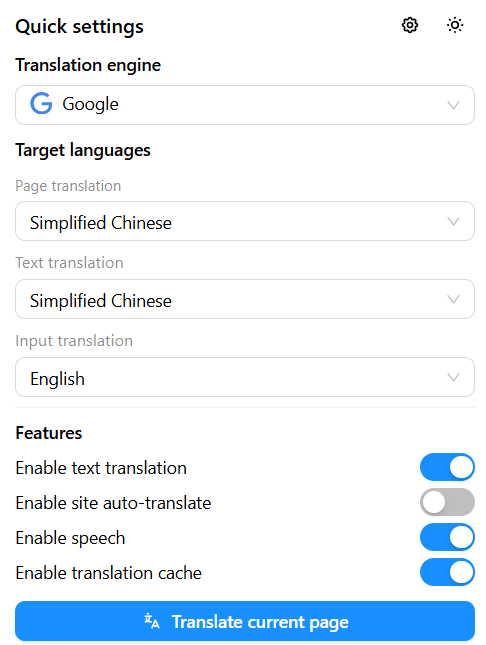
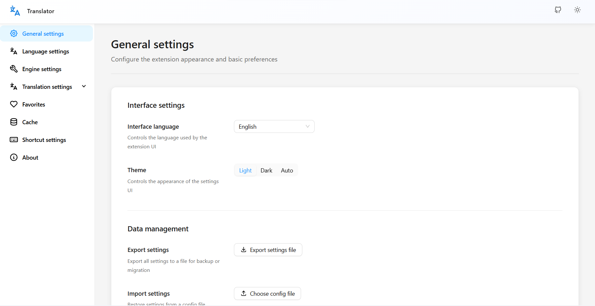

<p align="center">
  
</p>

# Translator

<p align="center">
  <strong>A multi-engine browser translation extension for the modern web</strong><br />
  <a href="./README.zh.md">中文</a>
</p>

## Overview

`Translator` is a browser extension built with `Plasmo + React + TypeScript`, focused on practical web translation workflows. It covers selection translation, full-page translation, input translation, speech playback, caching, favorites, shortcuts, and multiple translation engines in a lightweight but extensible architecture.

The project is organized into four main parts:

- `popup`: quick actions for engine and language switching
- `options`: full settings center for language, cache, shortcuts, favorites, and behavior
- `contents`: in-page UI and interaction layer for selection and translation overlays
- `background`: request handling for translation, speech, cache, and messaging

## Highlights

- Multi-engine translation with built-in `Bing`, `Google`, `DeepL`, and `Yandex`
- Multi-scenario support for selection, full page, input fields, and auto-translate
- Speech playback with `Google TTS` and browser-native synthesis
- Local cache for faster repeated requests
- Complete settings for shortcuts, favorites, languages, and module behavior
- Built-in bilingual UI structure with Chinese and English resources

## Preview

<table>
  <tr>
    <td width="50%">
      
    </td>
    <td width="50%">
      
    </td>
  </tr>
  <tr>
    <td align="center"><strong>Quick Settings</strong><br />Switch engines, target languages, and key features in one place</td>
    <td align="center"><strong>Settings Page</strong><br />Manage appearance, language, cache, shortcuts, and translation modules</td>
  </tr>
</table>

## Features

- Selection translation with an inline result panel
- Full-page translation with restore-to-original support
- Auto-translate rules for specific websites
- Input translation for writing and editing workflows
- Speech playback for translated text
- Local translation cache for repeated requests
- Favorites management for frequently used words and phrases
- Shortcut support for fast translation actions
- Modular settings pages for engines, languages, cache, and behavior

## Tech Stack

- Framework: `Plasmo`
- UI: `React 18` + `Ant Design`
- Language: `TypeScript`
- i18n: `i18next` + `react-i18next`
- Storage: `chrome.storage` + `IndexedDB`

## Project Structure

```text
.
|-- background/   # background handlers, translation engines, speech, cache
|-- contents/     # content scripts, selection UX, translation overlays
|-- options/      # settings pages
|-- popup/        # extension popup
|-- lib/          # shared constants, types, settings, translation core
|-- i18n/         # localization resources
|-- assets/       # icons and screenshots
```

## Getting Started

### 1. Install dependencies

```bash
pnpm install
```

or:

```bash
npm install
```

### 2. Start development

```bash
pnpm dev
```

### 3. Load the extension

Load the generated development build in your browser extension manager. For example, Chrome Manifest V3 uses:

```text
build/chrome-mv3-dev
```

## Build and Package

```bash
pnpm build
pnpm package
```

## Usage

1. Select text on any webpage to trigger translation.
2. Use the popup to switch the default engine and target language.
3. Enable auto-translate for your frequent websites.
4. Configure cache, speech, shortcuts, favorites, and translation behavior in the settings page.

## Use Cases

- Reading foreign-language articles, docs, and product pages
- Browsing multilingual communities, forums, and news websites
- Assisting bilingual writing and text input
- Listening to translated content with speech playback

## Roadmap

- Add richer usage demos and animated walkthroughs
- Support more providers and custom engine integrations
- Improve full-page translation stability and performance
- Expand site-level dictionaries and personalized translation settings

## Development

Common commands:

```bash
pnpm dev
pnpm build
pnpm package
```

Recommended entry points for contributors:

- `lib/translate/*` for translation core logic
- `background/messages/*` for request handling
- `options/pages/*` for settings modules
- `contents/*` for in-page interaction logic

## Contributing

Issues and pull requests are welcome, especially for:

- New engine integrations
- UI / UX improvements
- Documentation updates
- Bug fixes
- Localization improvements

## License

This project is licensed under [Apache-2.0](../LICENSE).
