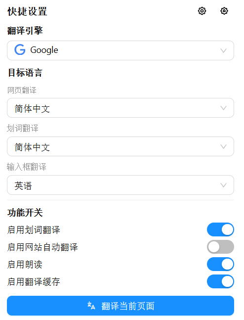
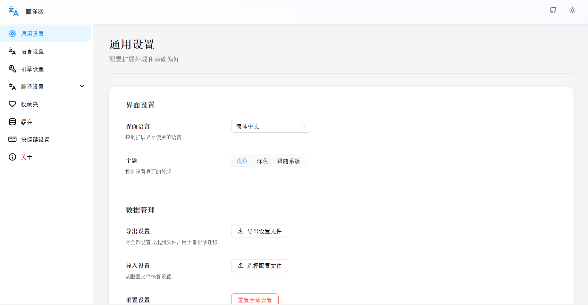

<p align="center">
  
</p>

# Translator

<p align="center">
  <strong>一个面向浏览器的多引擎网页翻译扩展</strong><br />
  <a href="./README.en.md">English</a>
</p>

## 项目简介

`Translator` 是一个基于 `Plasmo + React + TypeScript` 构建的浏览器扩展，专注网页翻译场景。它覆盖划词翻译、整页翻译、输入框翻译、语音朗读、缓存、收藏、快捷键和多翻译引擎切换，目标是提供一个轻量、直接、可扩展的沉浸式翻译工具。

当前项目主要由四个部分组成：

- `popup`：快捷操作面板，适合快速切换引擎和目标语言
- `options`：完整设置中心，管理语言、缓存、快捷键、收藏等配置
- `contents`：页面内交互层，负责划词、悬浮结果、整页翻译触发
- `background`：后台能力层，处理翻译请求、语音、缓存和消息分发

## 核心亮点

- 多引擎翻译：内置 `Bing`、`Google`、`DeepL`、`Yandex`
- 多场景支持：划词、整页、输入框、站点自动翻译
- 语音朗读：支持 `Google TTS` 和浏览器原生语音合成
- 本地缓存：减少重复请求，提升二次访问速度
- 配置完整：支持快捷键、收藏、语言和模块化设置
- 双语界面：内置中文和英文国际化资源

## 项目预览

<table>
  <tr>
    <td width="50%">
      
    </td>
    <td width="50%">
      
    </td>
  </tr>
  <tr>
    <td align="center"><strong>中文弹窗</strong><br />快速切换翻译引擎、目标语言和常用功能</td>
    <td align="center"><strong>中文设置页</strong><br />集中管理外观、语言、缓存、快捷键和翻译模块</td>
  </tr>
</table>

## 功能特性

- 划词翻译：选中文本后快速展示结果浮层
- 整页翻译：支持当前页面一键翻译与恢复原文
- 网站自动翻译：可按站点启用自动翻译策略
- 输入框翻译：辅助输入和双语写作
- 语音播放：将翻译结果直接朗读出来
- 翻译缓存：重复文本优先命中本地缓存
- 收藏夹：沉淀高频词句，便于复用
- 快捷键：快速触发划词翻译或整页翻译
- 设置中心：按模块管理引擎、语言、缓存和行为偏好

## 技术栈

- Framework: `Plasmo`
- UI: `React 18` + `Ant Design`
- Language: `TypeScript`
- i18n: `i18next` + `react-i18next`
- Storage: `chrome.storage` + `IndexedDB`

## 项目结构

```text
.
|-- background/   # 后台消息、翻译引擎、语音、缓存
|-- contents/     # 页面注入逻辑、划词交互、翻译浮层
|-- options/      # 设置页
|-- popup/        # 扩展弹窗
|-- lib/          # 公共类型、常量、设置、翻译核心逻辑
|-- i18n/         # 国际化资源
|-- assets/       # 图标与截图等静态资源
```

## 快速开始

### 1. 安装依赖

```bash
pnpm install
```

或：

```bash
npm install
```

### 2. 启动开发环境

```bash
pnpm dev
```

### 3. 加载扩展

在浏览器扩展管理页中加载开发产物，例如 Chrome Manifest V3 对应目录：

```text
build/chrome-mv3-dev
```

## 构建与打包

```bash
pnpm build
pnpm package
```

## 使用方式

1. 在网页中选中文本，触发划词翻译。
2. 在扩展弹窗中切换默认引擎和目标语言。
3. 对常用站点开启自动翻译，提高浏览效率。
4. 在设置页中调整缓存、语音、快捷键、收藏和翻译策略。

## 适用场景

- 阅读外文文章、技术文档和产品资料
- 浏览跨语言社区、论坛、新闻和社交内容
- 双语写作、输入辅助和术语确认
- 听读翻译结果，提升阅读效率

## Roadmap

- 增加更完整的使用示例和演示动图
- 支持更多翻译服务或自定义引擎接入
- 持续优化整页翻译稳定性与性能
- 完善站点级词典和个性化翻译配置

## 开发说明

常用命令：

```bash
pnpm dev
pnpm build
pnpm package
```

建议优先阅读这些目录：

- `lib/translate/*`：翻译核心流程
- `background/messages/*`：消息分发与后台处理
- `options/pages/*`：设置页模块
- `contents/*`：页面侧交互逻辑

## 贡献

欢迎通过 `Issue` 或 `Pull Request` 参与改进：

- 新翻译引擎接入
- UI / UX 优化
- 文档补充
- Bug 修复
- 国际化完善

## License

本项目基于 [Apache-2.0](../LICENSE) 开源。
